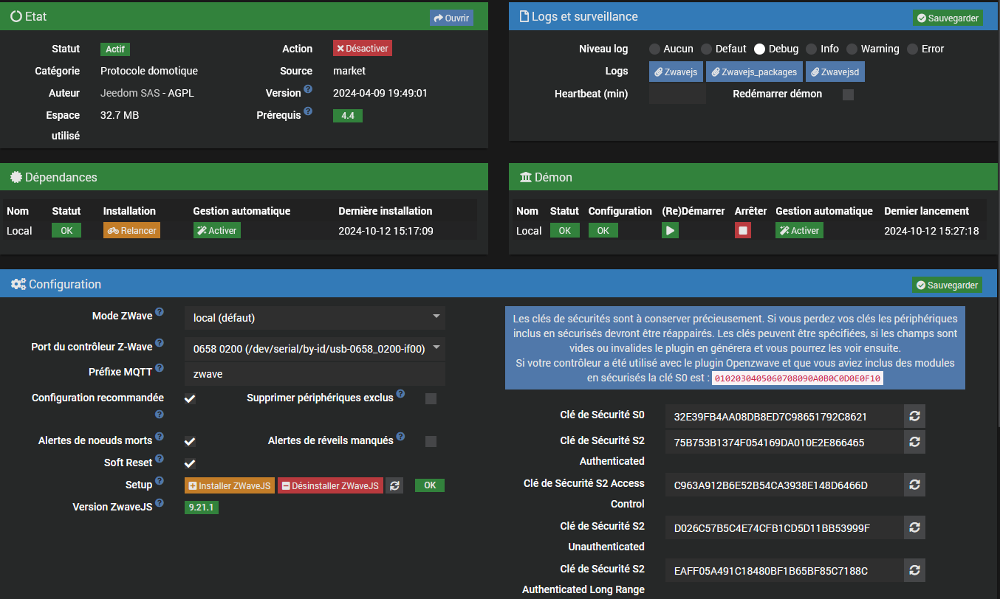
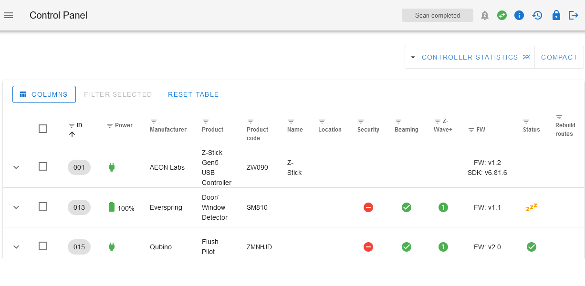
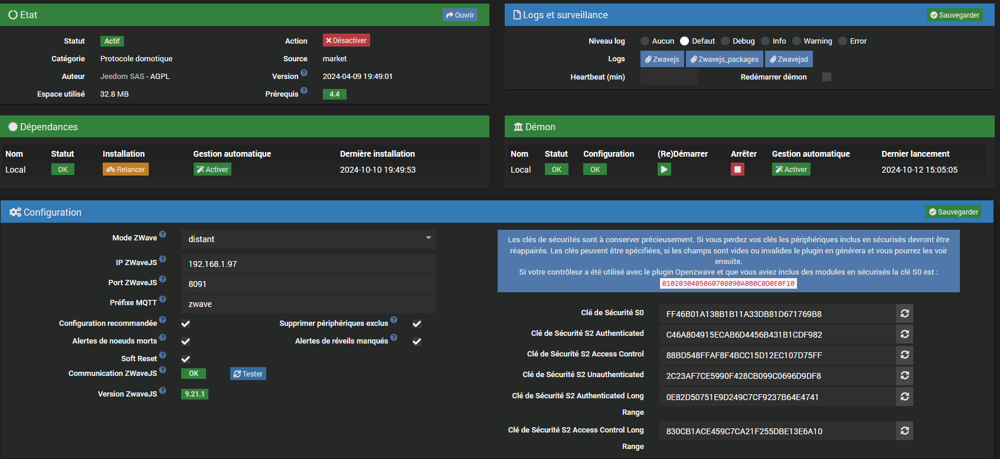
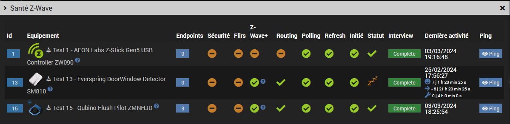

# Plugin Zwave-Js

Version améliorée du plugin officiel [zwavejs](https://github.com/jeedom/plugin-zwavejs) avec antenne ZWaveJS distante.
 
Le plugin a été testé avec une antenne docker mais il doit également fonctionner avec une install yarn.

## Mode local
Attention l'installation des dépendances n'installe plus le deamon local, il faut utiliser le bouton `ìnstaller ZwaveJS`.
 La version `zwave-js-ui` qui sera installée et le préfixe MQTT par défaut se trouvent dans le fichier `core/config/zwavejs.config.ini`

  L'installation se lance en tâche de fond et prend un certain temps. Vous pouvez vérifier le statut avec le bouton `rafraichir`
  L'avancement de l'installation se trouve dans le fichier de log `zwavejs_packages`.
  Le voyant doit être vert et à OK et la version doit s'afficher en dessous une fois l'installation terminée.

Le fonctionnement est identique à celui du plugin officel. Pour plus d'infos voir la [doc](https://doc.jeedom.com/fr_FR/plugins/automation%20protocol/zwavejs) du plugin ZWaveJS

## Mode distant (non managé)
Ce mode est réservé aux utilisateurs expérimentés sachant utiliser la ligne de commande.
 

Copier et extraire l'archive générée `data/remote/docker_config.tar.gz` dans un répertoire local sur la machine distante ex:

	$ sudo mkdir -p /root/store/zwavejs
	$ cd /root/store/zwavejs
	$ sudo tar xvfz /tmp/docker_config.tar.gz

Vous devez obtenir l'arborescence suivante:

	/root/store/zwavejs/config.json
	/root/store/zwavejs/config/

Copier et utiliser le script `resources/zwavejs` sur la machine distante pour gérer le container

### Installation de l'image

Installer l'image `zwave-js-ui` sur le docker distant:

	$ sudo docker pull zwavejs/zwave-js-ui

ou installation + démarrage du container:

	$ sudo zwavejs start

### Démarrage et arrêt du container

	$ sudo zwavejs
	usage: zwavejs {start|stop|restart|status}

Si vous utilisez un répertoire local différent de `/root/store/zwavejs` modifiez le dans le script
 Idem pour le device, par exemple: `/dev/ttyACM0`

### Vérification du container

Connectez-vous sur `http://remote-ip:8091`

* Login: admin
* Password: zwave

Au bout de quelques secondes le driver doit passer à `Connected` (icône rond vert) et le statut à `Scan completed` 

### Paramètrage du plugin:
Page de configuration du plugin:

* IP ZWaveJS: adresse du service de l'antenne distante (docker ou pas)
* Port ZWaveJS: Port d'administration du service (défaut 8091)
* Préfixe MQTT (défaut zwave)
* Communication ZWaveJS et bouton `Tester`: vert si le service distant est démarré et disponible
* Version ZWaveJS: version du service distant

Vérifiez la communication en cliquant sur le bouton `Tester`
 Le voyant `communication` doit passer au vert:

 Note: La version se mettra à jour après démarrage du deamon

### Démarrage du deamon
 Vous pouvez maintenant démarrer votre deamon Jeedom puis vérifier que les infos remontent:

